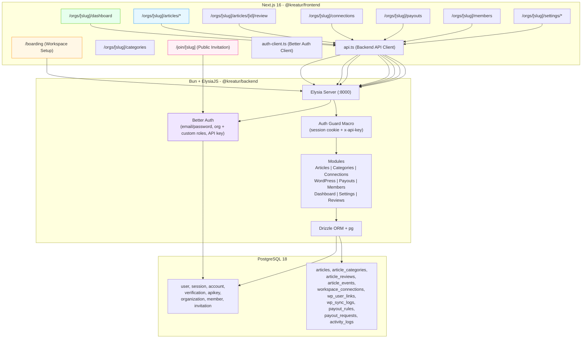

# Project Overview

Kreatur is a white-label editorial management platform for content organizations—
media, communities, agencies, educational institutions, and brands. It unifies
the contributor writing, review, approval, honor/payout, and content distribution
workflow into a single workspace. The product is a SaaS monorepo with a Bun +
Elysia backend (Drizzle ORM, PostgreSQL, Better Auth) and a Next.js 16 + shadcn/ui
frontend. Core features: article management with rich-text editing, customizable
editorial workflows (Draft → Review → Approve → Publish), WordPress integration,
contributor honor tracking and payout management, team collaboration with
RBAC, and activity logging. All UI text and documentation are
in Indonesian.

## Repository Structure

- **`backend/`** — Bun + ElysiaJS (v1) API server. Modular routers under
  `src/modules/`, Drizzle ORM schema & migrations, Better Auth integration.
- **`frontend/`** — Next.js 16 (App Router) + React 19 + Tailwind CSS v4 +
  shadcn/ui + Biome. Includes config, hooks, stores, server actions, and
  theme/preset system.
- **`plan.json`** — Plan configuration (limits per subscription tier).
- **`.agents/skills/`** — Locked agent skill definitions (Better Auth, Elysia,
  shadcn, etc.) installed via `skills-lock.json`.
- **`.pgdata/`** — Local PostgreSQL data directory (gitignored, bootstrapped by
  Docker Compose).
- **`.zed/`** — Zed editor workspace settings, including MCP context servers for
  shadcn, PostgreSQL, and Better Auth.
- **`docker-compose.yaml`** — Orchestrates `db` (PostgreSQL 18), `adminer`,
  `backend`, `frontend`, and `nginx` services.
- **`nginx/`** — Nginx reverse proxy configuration for production deployment.

## Build & Development Commands

```sh
# Install all workspace dependencies (from repo root)
bun install

# Start both backend and frontend in parallel (development)
bun run dev

# Start backend only (Bun watch mode on src/index.ts)
bun run dev:backend

# Start frontend only (Next.js dev server)
bun run dev:frontend

# Build both workspaces for production
bun run build

# ─── Database (Drizzle ORM) ──────────────────────────────

# Generate SQL migrations from schema changes
bun run db:generate

# Apply pending migrations to the database
bun run db:migrate

# Push schema directly (fast iteration, no migration files)
bun run db:push

# Launch Drizzle Studio GUI for data browsing
bun run db:studio

# ─── Auth (Better Auth) ──────────────────────────────────

# Regenerate Better Auth schema/migrations
bun run auth:generate

# Apply Better Auth migrations
bun run auth:migrate

# ─── Seed (test data) ────────────────────────────────────

# Seed 1 workspace + 5 users + 5 categories + 5 articles
bun run seed

# ─── Frontend-only (from frontend/ directory) ────────────

# Lint with Biome
bun run lint

# Format with Biome
bun run format

# Full Biome check (lint + format + organize imports)
bun run check

# Fix all auto-fixable issues
bun run check:fix

# Generate theme CSS presets from tokens
bun run generate:presets

# ─── Docker (full stack) ─────────────────────────────────

# Start all services (db, adminer, backend, frontend, nginx)
docker compose up

# Start only database (for local dev)
docker compose up db -d

# Start adminer alongside db
docker compose --profile admin up db adminer -d
```

## Code Style & Conventions

### Formatting & Linting

- **Biome** (v2.5) is the single formatter + linter for the frontend workspace.
  Configuration lives in `frontend/biome.json`.
- Backend formatting is deferred to EditorConfig + manual convention.
- **EditorConfig** at repo root enforces: 2-space indentation, `lf` line endings,
  UTF-8, trailing whitespace stripped (except `.md`), final newline required.
- **Husky** + **lint-staged** runs `biome check --write` on staged `*.js/ts/jsx/tsx`
  files automatically on commit.

### Naming Conventions

- **Files:** PascalCase for components (`ArticleTable.tsx`), camelCase for
  utilities/hooks (`use-auth.ts`, `api.ts`). Biome enforces file-naming conventions.
- **Variables/Properties:** camelCase throughout.
- **Database tables:** snake_case (`article_categories`).
- **Elysia routers:** camelCase suffixed with `Router` (`articlesRouter`).
- **Environment variables:** `UPPER_SNAKE_CASE` with `NEXT_PUBLIC_` prefix for
  client-exposed frontend vars.

### TypeScript

- Strict mode enabled in both `tsconfig.json` files.
- Backend uses `@sinclair/typebox` for runtime validation on API inputs.
- Frontend uses `zod` (v4) for form validation with `@hookform/resolvers`.
- Prefer `const` assertions, self-closing JSX elements, arrow functions.

### Commit Messages

- Not strictly enforced, but prefer conventional commits:
  `feat:`, `fix:`, `chore:`, `refactor:`, `docs:`, `style:`.
- Use Indonesian for description body when relevant.

### UI Components

- **Must use atomic components** from **shadcn/ui** (`frontend/src/components/ui/`) or
  **DiceUI** (`frontend/src/components/diceui/`) for every UI element — buttons, inputs,
  dialogs, dropdowns, cards, badges, tables, selects, checkboxes, radio groups, toasts,
  sheets, popovers, tooltips, avatars, command palettes, etc.
- **Do NOT** write custom HTML elements with raw Tailwind classes when a shadcn/ui or
  DiceUI component exists for that purpose (e.g., use `<Button>` not `<button className="...">`).
- DiceUI components are installed under `frontend/src/components/diceui/` via the
  DiceUI registry (https://diceui.com/docs/installation). Refer to DiceUI docs for
  available components: https://diceui.com/docs/components.
- **Tailwind `className` is only permitted for layout purposes:**
  - Flex/Grid: `flex`, `grid`, `items-center`, `justify-between`, `gap-*`, etc.
  - Spacing: `p-*`, `px-*`, `py-*`, `m-*`, `mx-*`, `my-*`, `space-*`.
  - Width/height constraints: `w-full`, `h-full`, `max-w-*`, `min-h-*`.
- **Prohibited** in custom `className`:
  - Colors (`text-*`, `bg-*`, `border-*`, `ring-*`)
  - Typography (`text-*` sizing, `font-*`)
  - Borders, shadows, rounded corners
  - Any visual/styling class. These must come from the atomic component's props
    (e.g., `<Button variant="destructive">` not `<button className="bg-red-500">`).
- If a needed atomic component doesn't exist yet in either shadcn/ui or DiceUI,
  add it via:
  ```sh
  bun run shadcn add <component-name>
  ```
  or install from DiceUI registry following its CLI instructions. After adding,
  use the component from its designated path.

## Architecture Notes



### Data Flow

1. **Auth:** Session-based via Better Auth (cookies). Public invitation uses no
   auth. API key (`x-api-key` header) supported for programmatic access.
2. **Multi-tenant:** Each organization (workspace) has its own slug-based URL
   (`/orgs/[slug]/*`). Membership is enforced by the `auth-guard.ts` Elysia
   macro on every protected route. Custom roles via Better Auth Dynamic Access
   Control (`owner`, `editor`, `reviewer`, `contributor`, `finance`).
3. **Editorial Workflow:** Articles flow through `DRAFT → PENDING_REVIEW →
REVISION_REQUESTED → APPROVED → PUBLISHED`. Each status transition records
   an `article_event` for the activity timeline. Reviews include score, notes,
   and decision.
4. **WordPress Integration:** Workspace connects to WordPress via REST API +
   Application Password. `APPROVED` articles can be published to WordPress in one
   click. Idempotent via `external_post_id`. Retry up to 3 times with 30s delay.
5. **Honor & Payout:** Workspace configures honor rules (nominal per article,
   payout threshold). Contributors can request payouts on eligible articles.
   Finance/Admin verifies and marks as `PAID` with proof of transfer.
6. **File Uploads:** Attachments (images, screenshots) stored on local filesystem
   under `backend/storage/uploads/`, served via `GET /uploads/*`.

### Key Modules (Backend)

| Module      | Path                               | Purpose                                   |
| ----------- | ---------------------------------- | ----------------------------------------- |
| Articles    | `backend/src/modules/articles/`    | CRUD + workflow status + events           |
| Categories  | `backend/src/modules/categories/`  | Article categories per workspace          |
| WordPress   | `backend/src/modules/wordpress/`   | WP REST API connection + publish          |
| Connections | `backend/src/modules/connections/` | Workspace connection management           |
| Payouts     | `backend/src/modules/payouts/`     | Honor rules + payout requests             |
| Members     | `backend/src/modules/members/`     | Team invitation + role management         |
| Dashboard   | `backend/src/modules/dashboard/`   | Aggregated stats + activity feed          |
| Settings    | `backend/src/modules/settings/`    | Workspace profile, preferences, AI toggle |
| Reviews     | `backend/src/modules/reviews/`     | Article review (score, notes, decision)   |

## Security & Compliance

- **Secrets:** `.env`, `.env.*` files are gitignored. A `.env.example` is used
  for documentation. Never commit secrets.
- **Auth:** Better Auth manages sessions (7-day expiry, 1-day rotation),
  rate-limiting (100 req/min), password policies (min 8 chars), and secure
  cookies in production.
- **WordPress credentials** are encrypted at rest in the database; never logged
  in plaintext.
- **API Keys:** Org-level API keys via Better Auth `apiKey` plugin with
  rate-limit (1000/hr) and enable/disable controls.
- **Multi-tenancy:** Shared DB with row-level isolation via `workspaceId` on
  every query + membership verification in `auth-guard.ts`.
- **Membership-based access:** The `auth-guard.ts` macro verifies session + org
  membership on every protected route. API keys are scoped to their organization.
- **Dependency scanning:** Not configured. TODO: integrate `bun audit` or Dependabot.
- **License:** Not yet specified. TODO: Choose an open-source license.

## Agent Guardrails

<!-- BEGIN:nextjs-agent-rules -->

- **This is NOT the Next.js you know** — this version has breaking changes. APIs,
conventions, and file structure may all differ from your training data. Read the
relevant guide in `node_modules/next/dist/docs/` before writing any frontend code.
Heed deprecation notices.
<!-- END:nextjs-agent-rules -->

- **Do NOT** modify files in `node_modules/`, `.next/`, `dist/`, or `.pgdata/`.
  These are generated or external.
- **Do NOT** modify `drizzle/` migration files directly. Regenerate via
  `bun run db:generate`.
- **Do NOT** commit changes without running `bun run check` (frontend) and
  verifying the backend compiles (`bun run --filter @kreatur/backend build`).
- **Do NOT** touch generated UI components under `frontend/src/components/ui/`
  or `frontend/src/components/calendar/` — they are managed by shadcn CLI.
- Any changes to Better Auth configuration in `backend/src/auth.ts` require
  running `bun run auth:generate` afterwards.
- **Always** run `bun install` after modifying `package.json` dependencies.
- PRs/commits that touch files under `backend/src/db/schema/` must also include the
  corresponding Drizzle migration (generated via `bun run db:generate`).
- **Always** use shadcn/ui or DiceUI atomic components for UI. Do NOT write raw JSX
  elements (`<div>`, `<span>`, `<button>`, `<input>`) with Tailwind styling — import
  the atomic component instead.
- Tailwind `className` is restricted to layout-only classes (flex, grid, padding,
  margin). Visual styling (colors, typography, borders, shadows) must be done via
  component props (`variant`, `size`, `className` only for layout overrides).

## Extensibility Hooks

### Environment Variables

| Variable                  | Default                 | Scope    | Purpose                             |
| ------------------------- | ----------------------- | -------- | ----------------------------------- |
| `DATABASE_URL`            | —                       | Backend  | PostgreSQL connection string        |
| `BETTER_AUTH_URL`         | `http://localhost:8000` | Backend  | Auth callback base URL              |
| `BETTER_AUTH_SECRET`      | —                       | Backend  | Auth signing secret (required)      |
| `FRONTEND_URL`            | `http://localhost:3000` | Backend  | CORS origin + email link base       |
| `NEXT_PUBLIC_BACKEND_URL` | `http://localhost:8000` | Frontend | Backend API endpoint                |
| `PORT`                    | `8000` / `3000`         | Both     | Server listen port                  |
| `UPLOAD_DIR`              | `./storage/uploads`     | Backend  | File upload storage path            |
| `NODE_ENV`                | —                       | Both     | `production` enables secure cookies |
| `GOOGLE_CLIENT_ID`        | —                       | Backend  | Google OAuth client ID              |
| `GOOGLE_CLIENT_SECRET`    | —                       | Backend  | Google OAuth client secret          |
| `GITHUB_CLIENT_ID`        | —                       | Backend  | GitHub OAuth client ID              |
| `GITHUB_CLIENT_SECRET`    | —                       | Backend  | GitHub OAuth client secret          |
| `SMTP_HOST`               | —                       | Backend  | SMTP server host for email          |
| `SMTP_PORT`               | `587`                   | Backend  | SMTP server port                    |
| `SMTP_USER`               | —                       | Backend  | SMTP username                       |
| `SMTP_PASS`               | —                       | Backend  | SMTP password                       |
| `SMTP_FROM`               | —                       | Backend  | Email sender address                |
| `OPENCODE_API_URL`        | —                       | Backend  | AI suggestions API endpoint         |
| `OPENCODE_API_KEY`        | —                       | Backend  | AI suggestions API key              |

### Feature Flags

- `requireEmailVerification: false` in `auth.ts` — flip to `true` to enforce
  email verification on signup.
- `organization.allowUserToCreateOrganization: true` — disable to restrict workspace
  creation to admin only.
- `organization.organizationLimit: 1` — adjust per plan (Free=1, Studio=3).
- `session.expiresIn` / `updateAge` — tune session duration and rotation.
- AI suggestions toggle per workspace in Settings (default: enabled).

### Plugin Points

- **Better Auth plugins:** Already using `organization` and `apiKey`. Custom
  roles (`owner`, `editor`, `reviewer`, `contributor`, `finance`) configured via
  Dynamic Access Control. The `twoFactor` plugin is listed in skills-lock but
  not yet wired.
- **shadcn registry:** Custom registries configured in `components.json`.
- **Elysia routers:** New modules follow the pattern in `backend/src/modules/`:
  create a folder, export an Elysia router, mount in `backend/src/index.ts`.
- **Connection types:** The `workspace_connections` table supports extensible
  `type` field. Currently only `wordpress` is implemented; new types (ghost,
  webhook, webflow) can be added without schema migration.
- **Theme presets:** CSS files in `frontend/src/styles/presets/` are loaded by
  `globals.css`. New presets can be added there.

## Further Reading

- [README.md](./README.md) — Full product description, features (in Indonesian).
- [PRD.md](./PRD.md) — Product Requirements Document: personas, information
  architecture, page specs, user flows, visual references.
- [TODO.md](./TODO.md) — Granular task tracker with completion status per module.

- [backend/src/auth.ts](./backend/src/auth.ts) — Better Auth configuration
  (plugins, session, email, rate limits).
- [backend/src/modules/auth-guard.ts](./backend/src/modules/auth-guard.ts) —
  Auth guard macro (session + API key).
- [backend/src/db/schema/](./backend/src/db/schema/) — Full Drizzle ORM
  schema (auth + business tables).
- [docker-compose.yaml](./docker-compose.yaml) — Full-stack deployment config.
- [backend/Dockerfile](./backend/Dockerfile) — Backend container build.
- [frontend/Dockerfile](./frontend/Dockerfile) — Frontend container build.
- [frontend/biome.json](./frontend/biome.json) — Biome linting/formatting rules.
- [plan.json](./plan.json) — Plan configuration for subscription tiers.
